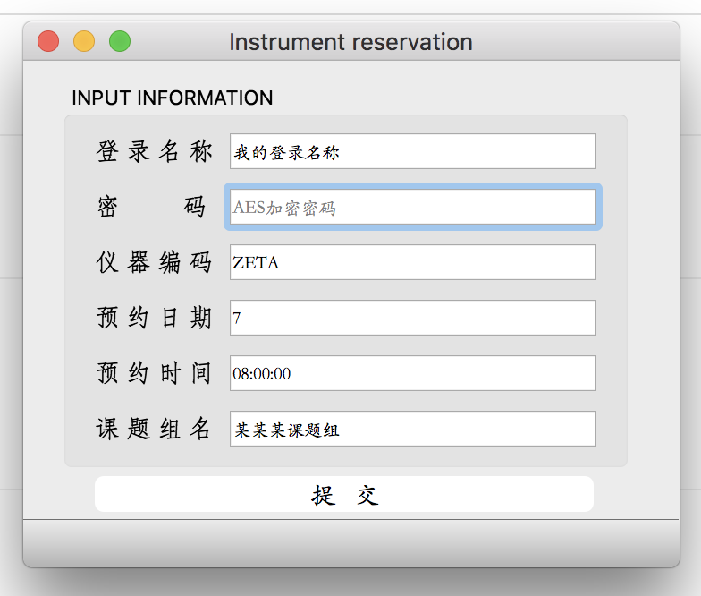
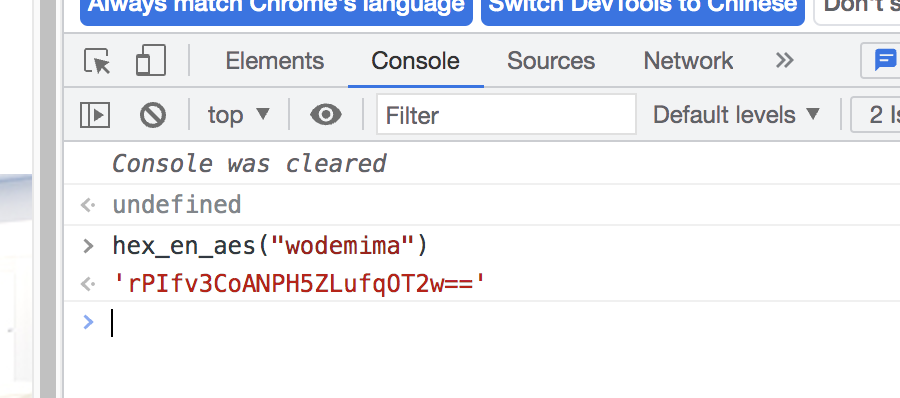
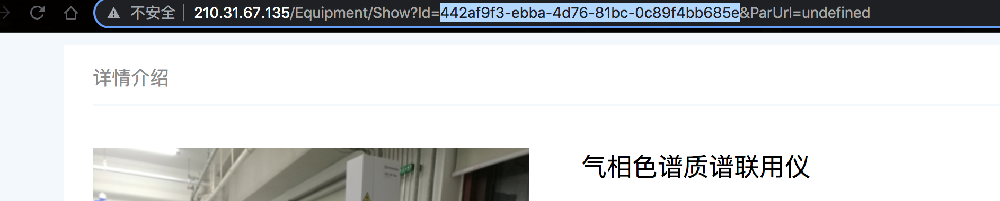
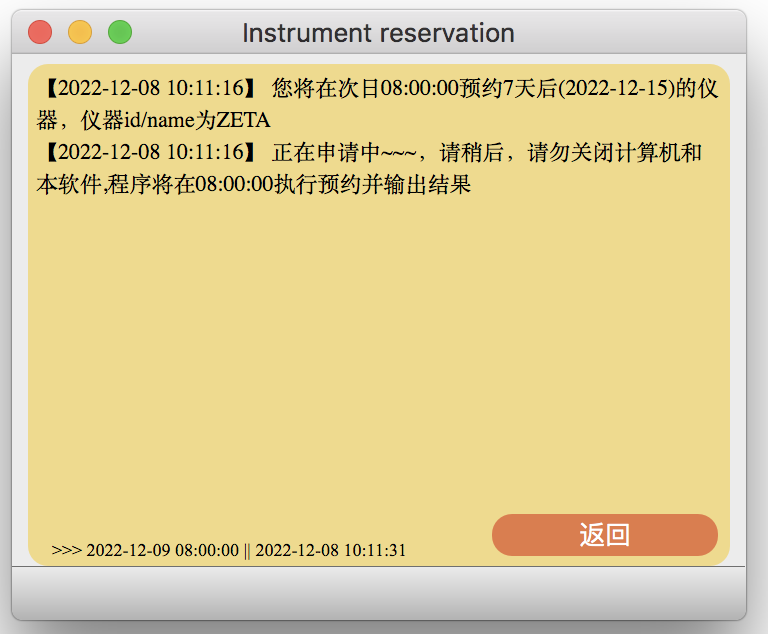

# HELP 帮助文件

## 软件介绍

本软件仅用于仪器预约情况，不建议日常使用。仅作为软件学习测试，未经许可，禁止外传

## 软件下载说明
本软件仅提供windows版本下载。直接下载for windows文件夹内文件即可。

## 软件使用说明

1. 软件名称：你的用户名

2. 密码：需要AES加密密码，密码获取方式如下：

    **方法一：**

   * 打开环境学院仪器预约平台网址 http://210.31.67.135/

   * 右键，检查（Edge或Chrome浏览器），点击右边的Console（调试）
   * 输入`hex_en_aes("你的登录密码")`，点击回车`enter`，即可获取加密密码。复制引号内部的密码并粘贴至软件内
   * 如图所示

    **方法二：**
      * 打开文件夹下的 获取加密密码.html 进行加密转化即可。
  
3. 仪器编码：本软件内置 LC，LCMSMS，ZETA，可直接输入名称，其他的需要手动输入仪器编码，操作如下：
   * 打开所需要预约仪器的网页，复制url中的仪器id，如`http://210.31.67.135/Equipment/Show?Id=442af9f3-ebba-4d76-81bc-0c89f4bb685e&ParUrl=undefined`中，仪器编码为**442af9f3-ebba-4d76-81bc-0c89f4bb685e**，将其粘贴至软件内。
   * 

4. 预约日期：填写数字，意思为预约几天后的仪器（提交后会显示具体哪一天，方便核验）
5. 预约时间：预约时间为正式开始启动预约仪器模块工作时间。请填入系统要求的时间。
6. 课题组名，必填项，提交任务时需要，一般为***课题组（※代表导师姓名）

【温馨提示：第一次成功填写后系统会自动记录本数据，下次打开软件后会自动载入】

**提交后显示的界面**

1. 此界面为日志记录界面，记录操作日志和申请状态返回结果日志。成功或失败，均可查看的到。
2. 左下角为申请模块正式启动的时间和当前系统时间，当其一致时，将运行申请模块程序。
3. 返回🔙 即终止本预约程序，返回到登录界面。
